# MayaWorld: The Large-Scale 22 Connected Maps Design Catalog

To scale MayaWorld into a rich, immersive GBA-style overworld matching the feel of *Pokémon Emerald*, we transition from a single procedural map to a system of **22 distinct, highly-detailed maps**. The primary outdoor regions are configured as massive **80x80 grids**, providing ample room for environmental puzzles, multiple hut settlements, interactive objects, and paths.

---

## Overworld Map Connection Graph

Below is the connection graph showing how the player navigates through the different maps of Mayaworld:

```mermaid
graph TD
    %% Suryanagar Village (1-5)
    M1["[1] Suryanagar Village Square<br>(80x80 | Grass & Gold)"] <-->|Door| M2["[2] Sage Bhrigu's Ashram<br>(20x20 | Warm Wood)"]
    M1 <-->|Door| M3["[3] Reva's Farmhouse<br>(16x16 | Herb Pots & Crops)"]
    M1 <-->|Door| M4["[4] Village Hut<br>(16x16 | Traditional Mats)"]
    M1 <-->|Path| M5["[5] South Sacred Shrine<br>(40x40 | Cherry Blossoms)"]
    
    %% Forest (6-9)
    M1 <-->|North Pass| M6["[6] Sacred Grove Entrance<br>(80x80 | Deep Forest Green)"]
    M6 <-->|Door| M7["[7] Sage Vashistha's Hermitage<br>(20x20 | Scrolls & Books)"]
    M6 <-->|Path| M8["[8] Canopy of Roots<br>(80x80 | Mossy Stones)"]
    M8 <-->|Cave Entrance| M9["[9] Whispering Caves<br>(40x40 | Dark Teal Crystals)"]
    
    %% Volcanic Forge (10-13)
    M1 <-->|Northeast Pass| M10["[10] Volcanic Ascent Path<br>(80x80 | Craggy Red Sand)"]
    M10 <-->|Door| M11["[11] Daksha's Volcanic Forge<br>(24x24 | Active Anvils)"]
    M10 <-->|Cave Entrance| M12["[12] Lava Caves (Relic Chamber)<br>(40x40 | Obsidian & Lava)"]
    M10 <-->|Path| M13["[13] Crag Heights (Volcano Rim)<br>(40x40 | Sulfur Vents)"]

    %% Sunken Temple (14-17)
    M1 <-->|East Coast Swim| M14["[14] Submerged Column Hall<br>(80x80 | Turquoise Water)"]
    M14 <-->|Temple Gate| M15["[15] Sanctuary of Time<br>(32x32 | Ancient Teal Columns)"]
    M14 <-->|East Path| M16["[16] Coral Reef Shore<br>(80x80 | Golden Sand)"]
    M16 <-->|Whirlpool Warp| M17["[17] Tidal Ruins Vault<br>(24x24 | Water Portal)"]

    %% Mountains (18-20)
    M6 <-->|West Mountain Path| M18["[18] Snowy Mountain Pass<br>(80x80 | Soft Snow White)"]
    M18 <-->|Door| M19["[19] Mahameru Hermitage<br>(16x16 | Hearth Fire)"]
    M18 <-->|Summit Climb| M20["[20] Silent Peak Summit<br>(40x40 | Starlight Sky)"]

    %% Spiritual Anchors (21-22)
    M5 <-->|Central Steps| M21["[21] Temple of Vows Altar<br>(80x80 | White Marble & Gold)"]
    M21 <-->|Eclipse Eclipse Portal| M22["[22] Cosmic Center Void<br>(80x80 | Astral Purple)"]
```

---

## Interactive Elements ("Many Things")

Across these 22 maps, the following interactive features are integrated to enrich gameplay:
1.  **Chests (Relics & Breath)**: Locked or hidden chests that yield ancient relics (Rage, Pride, Desire) or permanent Breath upgrades.
2.  **Signboards & Notice Boards**: Read-only GBA text signs that share lore snippets, survival advice, and local map directions.
3.  **Environmental Obstacles**:
    *   *Ice Slides* (Snowy Mountain Pass): Slippery paths that push Samat automatically until he hits an obstacle.
    *   *Lava Streams* (Volcanic Ascent): Harming liquid tiles that slowly drain breath if walked upon.
    *   *Water Currents* (Sunken Hall): Currents that sweep the player in a set direction unless swimming speed is upgraded.
    *   *Pushable Stones* (Grove): Heavy rock boulders that can be pushed to clear paths or uncover shortcuts.

---

## Detailed Map Design Specs

### Region 1: Suryanagar (Suryanagar Village)
Warm, bright green, and sandy gold color palettes. A peaceful agricultural setting.

#### 1. Suryanagar Village Square (Size: 80x80 | Color: Grass Green / Path Gold)
*   **Description**: A massive valley settlement. Contains paved paths, fences, a community water well, flowerbeds, sheep pens, and a large irrigation river with bridges.
*   **Warp Coordinates**:
    *   `(40, 79)` -> Beach Exit.
    *   `(12, 24)` -> Door to **Sage Bhrigu's Ashram** `[2]`.
    *   `(34, 28)` -> Door to **Reva's Farmhouse** `[3]`.
    *   `(56, 32)` -> Door to **Village Hut** `[4]`.
    *   `(40, 0)` -> North exit to **Sacred Grove Entrance** `[6]`.
    *   `(79, 36)` -> East exit to **Volcanic Ascent Path** `[10]`.
    *   `(40, 60)` -> Path south-west to **South Sacred Shrine** `[5]`.
*   **NPCs**: Villagers gossiping; Hari the Trader pacing; children playing.
*   **Interactives**: Signboards, water well (Z to examine), crop harvesting grids.

#### 2. Sage Bhrigu's Ashram (Size: 20x20 | Color: Warm Cedar Wood)
*   **Description**: A spacious wooden hermitage with glowing fire braziers, books, scroll stacks, and sitting mats.
*   **Warp Coordinates**:
    *   `(10, 19)` -> Exit door to **Suryanagar Village Square** at `(12, 25)`.
*   **NPCs**: Sage Bhrigu (teaches Agni Vidya).

#### 3. Reva's Farmhouse (Size: 16x16 | Color: Thatch / Herb Green)
*   **Description**: Reva's cozy home decorated with seed bags, tools, and drying medicinal plants.
*   **Warp Coordinates**:
    *   `(8, 15)` -> Exit door to **Suryanagar Village Square** at `(34, 29)`.
*   **NPCs**: Reva the Farmer.

#### 4. Village Residential Hut (Size: 16x16 | Color: Straw Yellow / Light Wood)
*   **Description**: A typical village home with woven floors, pottery decorations, and beds.
*   **Warp Coordinates**:
    *   `(8, 15)` -> Exit door to **Suryanagar Village Square** at `(56, 33)`.
*   **NPCs**: Elder villager.

#### 5. South Sacred Shrine (Size: 40x40 | Color: Soft Pink Cherry / Slate Grey)
*   **Description**: A tranquil garden sanctuary populated by cherry blossom trees and stone monuments.
*   **Warp Coordinates**:
    *   `(20, 0)` -> Exit north to **Suryanagar Village Square** at `(40, 59)`.
    *   `(20, 20)` -> Steps up to **Temple of Vows Altar** `[21]`.
*   **Interactives**: South Shrine Altar (Sadhana breathing ritual).

---

### Region 2: Sacred Grove (Western Forest)
Lush, shadows, dense foliage, and dark teal-green color palette.

#### 6. Sacred Grove Entrance (Size: 80x80 | Color: Dark Forest Green)
*   **Description**: A vast forest entry trail with dense foliage walls, mossy rock fences, and ancient fallen tree bridges.
*   **Warp Coordinates**:
    *   `(40, 79)` -> South exit to **Suryanagar Village Square** at `(40, 1)`.
    *   `(16, 20)` -> Door to **Sage Vashistha's Hermitage** `[7]`.
    *   `(0, 40)` -> West exit to **Snowy Mountain Pass** `[18]`.
    *   `(40, 0)` -> North exit to **Canopy of Roots** `[8]`.
*   **NPCs**: Forest wardens; Sage Kratu standing near forest gate.

#### 7. Sage Vashistha's Hermitage (Size: 20x20 | Color: Deep Oak Wood / Gold Lining)
*   **Description**: A research hall filled with astronomical maps, scrolls, and glowing braziers.
*   **Warp Coordinates**:
    *   `(10, 19)` -> Exit door to **Sacred Grove Entrance** at `(16, 21)`.
*   **NPCs**: Sage Vashistha (teaches Brahma Vidya).

#### 8. Canopy of Roots (Size: 80x80 | Color: Moss Green / Mud Brown)
*   **Description**: A massive green labyrinth where giant tree trunks form natural maze walls. Hidden chests are scattered in recesses.
*   **Warp Coordinates**:
    *   `(40, 79)` -> South exit to **Sacred Grove Entrance** at `(40, 1)`.
    *   `(70, 12)` -> Cave mouth to **Whispering Caves** `[9]`.
*   **Interactives**: Pushable boulders blocking passages.

#### 9. Whispering Caves (Size: 40x40 | Color: Dark Teal / Glowing Indigo)
*   **Description**: Winding dark caverns with large crystal formations that illuminate paths.
*   **Warp Coordinates**:
    *   `(20, 39)` -> Exit cave mouth to **Canopy of Roots** at `(70, 13)`.
*   **Interactives**: Glowing crystal deposits, breath fragment chest.

---

### Region 3: Volcanic Peaks (NE Ridge)
Jagged volcanic rocks, dark gray obsidian, and glowing red lava colors.

#### 10. Volcanic Ascent Path (Size: 80x80 | Color: Lava Orange / Basalt Grey)
*   **Description**: A rugged climb over cracked lava fields. Wooden rope bridges cross magma streams.
*   **Warp Coordinates**:
    *   `(0, 40)` -> West exit to **Suryanagar Village Square** at `(78, 36)`.
    *   `(60, 24)` -> Door to **Daksha's Volcanic Forge** `[11]`.
    *   `(40, 8)` -> Cave mouth to **Lava Caves** `[12]`.
    *   `(79, 40)` -> East path to **Crag Heights** `[13]`.

#### 11. Daksha's Volcanic Forge (Size: 24x24 | Color: Charcoal Grey / Iron Red)
*   **Description**: A fortified stone forge fortress. Massive molten metal vats glow red.
*   **Warp Coordinates**:
    *   `(12, 23)` -> Exit door to **Volcanic Ascent Path** at `(60, 25)`.
*   **NPCs**: Daksha the Blacksmith (teaches Shilpa Vidya).

#### 12. Lava Caves (Size: 40x40 | Color: Burning Crimson / Obsidian Black)
*   **Description**: A molten lava cavern where coordinates must be planned to avoid fire tiles. Houses the Relic of Rage.
*   **Warp Coordinates**:
    *   `(20, 39)` -> Exit cave mouth to **Volcanic Ascent Path** at `(40, 9)`.
*   **Interactives**: Lava Relic Chest (Rage).

#### 13. Crag Heights (Size: 40x40 | Color: Sulfur Yellow / Slate Grey)
*   **Description**: A high mountain pass with sulfur steam vents blocking vision.
*   **Warp Coordinates**:
    *   `(0, 20)` -> West exit to **Volcanic Ascent Path** at `(78, 40)`.
*   **NPCs**: Sage Angiras (teaches Jyotish Vidya).

---

### Region 4: Sunken Temple (Eastern Coast)
Turquoise waters, golden sands, cyan ancient pillars.

#### 14. Submerged Column Hall (Size: 80x80 | Color: Sea Cyan / Turquoise Water)
*   **Description**: A massive coastline ruin with sand bars, stone bridges, and shallow reefs where Samat can walk.
*   **Warp Coordinates**:
    *   `(0, 40)` -> West exit to **Suryanagar Square** at `(78, 25)`.
    *   `(40, 16)` -> Giant stone gate to **Sanctuary of Time** `[15]`.
    *   `(79, 40)` -> East sandy trail to **Coral Reef Shore** `[16]`.

#### 15. Sanctuary of Time (Size: 32x32 | Color: Ocean Blue / White Jade)
*   **Description**: A flooded marble hall with ancient glyphs and columns.
*   **Warp Coordinates**:
    *   `(16, 31)` -> Exit gate to **Submerged Column Hall** at `(40, 17)`.
*   **NPCs**: Sage Pulaha (teaches Vaidya Kala).

#### 16. Coral Reef Shore (Size: 80x80 | Color: Sand Gold / Shallow Teal)
*   **Description**: A long, sandy shoreline surrounded by colorful coral reefs. A giant whirlpool spins in the ocean.
*   **Warp Coordinates**:
    *   `(0, 40)` -> West exit to **Submerged Column Hall** at `(78, 40)`.
    *   `(40, 40)` -> Whirlpool center -> Warp to **Tidal Ruins Vault** `[17]`.

#### 17. Tidal Ruins Vault (Size: 24x24 | Color: Water Portal Violet)
*   **Description**: An underground vault featuring columns and the chest of pride.
*   **Warp Coordinates**:
    *   `(12, 23)` -> Water portal exit -> Warp back to **Coral Reef Shore** at `(40, 41)`.
*   **Interactives**: Tidal Relic Chest (Pride).

---

### Region 5: Mahameru Ridge (Northern Mountains)
Snowy white, icy cyan, mountain cliffs.

#### 18. Snowy Mountain Pass (Size: 80x80 | Color: Pure White Snow / Ice Blue)
*   **Description**: A massive frozen pass. Snowy hills hide chests, and ice patches slide the player.
*   **Warp Coordinates**:
    *   `(79, 40)` -> East pass down to **Sacred Grove Entrance** at `(1, 40)`.
    *   `(30, 20)` -> Door to **Mahameru Hermitage** `[19]`.
    *   `(20, 0)` -> North climb to **Silent Peak Summit** `[20]`.
*   **Interactives**: Sliding Ice sheets, wooden signboards.

#### 19. Mahameru Hermitage (Size: 16x16 | Color: Logs Brown / Fire Hearth Gold)
*   **Description**: Cozy cabin with a warm stone fireplace and sleeping mats.
*   **Warp Coordinates**:
    *   `(8, 15)` -> Exit door to **Snowy Mountain Pass** at `(30, 21)`.
*   **NPCs**: Sage Pulastya (teaches Niti Shastra).

#### 20. Silent Peak Summit (Size: 40x40 | Color: Starry Black / Snow White)
*   **Description**: A peak showing starry night skies.
*   **Warp Coordinates**:
    *   `(20, 39)` -> South descent to **Snowy Mountain Pass** at `(20, 1)`.
*   **NPCs**: Sage Marichi (teaches Yoga Siddhi).

---

### Region 6: Spiritual Anchors (Central Anchors)
Clean white marble, golden pillars, cosmic purple dimensions.

#### 21. Temple of Vows Altar (Size: 80x80 | Color: Pure Alabaster / Sun Gold)
*   **Description**: A grand central temple plateau featuring white paved paths and a giant central stone altar.
*   **Warp Coordinates**:
    *   `(40, 79)` -> South steps down to **South Sacred Shrine** at `(20, 21)`.
    *   `(40, 40)` -> Altar step -> Warps player to **Cosmic Center Void** `[22]`.
*   **NPCs**: Sage Atri (teaches Bhu Vidya).

#### 22. Cosmic Center Void (Size: 80x80 | Color: Astral Nebula Violet)
*   **Description**: A massive astral void battleground containing floating marble pathways.
*   **Warp Coordinates**:
    *   `(40, 79)` -> Altar portal back to **Temple of Vows Altar** at `(40, 41)`.
*   **NPCs**: Mayasur (Final Boss).
