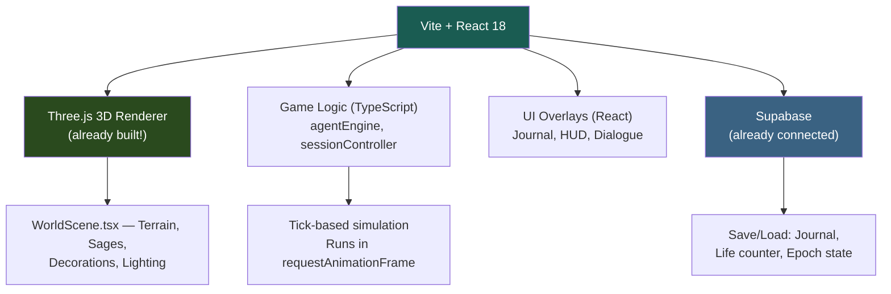

# MayaWorld — Game Design Bible v2
### *From Quiet Sanctuary to Living Myth*
### Decisions Locked ✓

---

## Decisions Summary

| Question | Your Decision |
|----------|--------------|
| **Scope** | Full game integrated into existing Manomaya website |
| **Renderer** | Three.js 3D isometric (already started in `three/` — best for the scope) |
| **Mayasur identity** | The cursed **Tenth Sage, Tamas** — freed, not killed |
| **Player reward** | After Tamas dissolves, the player's character **Samat** emerges — crowned the new sage by the remaining 9 |
| **Epochs** | 7 distinct time periods |
| **Multiplayer** | Deferred to post-launch (Lovable hosting constraints) |

---

## 1. The Story — Complete Arc

### Act I: Birth
The player is born as a baby in a random epoch, a random family, with a random gender. They grow up in a living civilization — farmers, potters, weavers fill the island. The world breathes around them.

### Act II: Discovery
The player discovers the 9 hidden sages, each teaching a unique Vidya. Along the way, they witness Mayasur's periodic city-destroying attacks. They learn that every individual skill fails against him — he has a counter for everything.

### Act III: The Curse
Through exploration, Memory Leaves, sage bonds, and ruin inscriptions, the player pieces together the truth: Mayasur is **Tamas**, the forgotten Tenth Sage, cursed by cosmic law (Rta) to destroy what he once sought to rule. The curse can only be broken by a mortal who achieves what Tamas achieved (all 9 skills) and does what Tamas refused — **sacrifice instead of domination**.

### Act IV: The Ritual
With all 9 Vidyas mastered, the Asthra of Tamas forged, the True Name discovered, at the Temple of Vows during a solar eclipse — the player performs the Offering. Tamas is freed. He appears as the sage he once was — weary, grateful — and dissolves into light.

### Act V: Samat Emerges
The island heals. The 9 sages gather. They recognize the player's achievement — mastery of all knowledge, yet choosing service over power. They bestow the title **"Samat"** — meaning "the one who is complete." The player's character becomes the **new Tenth Sage**, restoring balance to the world.

> [!TIP]
> **"Samat"** — from Sanskrit *samāpta* (complete/fulfilled). The player doesn't replace Tamas. They fill the gap that Tamas's fall created. The world was always meant to have ten.

**End Screen:** The island at dawn. Ten figures stand in a circle at the Temple of Vows. The player — Samat — is among them. A single sapling grows where Tamas dissolved. Credits roll over the living world continuing to breathe.

---

## 2. The 7 Epochs

Instead of 3 epochs, you wanted more depth. Here are 7 distinct time periods, each with a different world state. The same procedural island, but with overlay data that changes the feel:

| # | Epoch Name | Years | World State | Key Characteristic |
|---|-----------|-------|------------|-------------------|
| 1 | **Age of First Fire** | 0–200 | Primordial — dense forest, no settlements | Sages walk openly among wild nature. No civilization. Pure discovery. |
| 2 | **Age of Roots** | 200–600 | First villages form, farming begins | Simple huts, pottery, small communities. Sages are revered village elders. |
| 3 | **Age of Rivers** | 600–1200 | Trade routes, river settlements, cultural flowering | Markets, craftsmanship, festivals. Sages begin to withdraw from daily life. |
| 4 | **Age of Temples** | 1200–2000 | Grand temples, structured society, golden age | Largest settlements, richest economy. Sages are distant legends. First Mayasur attack. |
| 5 | **Age of Fracture** | 2000–2800 | Mayasur attacks intensify, cities crumble | Refugees, destroyed settlements, fear. Sages hide. Curse fragments most accessible. |
| 6 | **Age of Embers** | 2800–3400 | Scattered survivors, ruins dominate the landscape | Ghost towns, overgrown temples. The world is dying. Sages are nearly impossible to find. |
| 7 | **Age of Silence** | 3400–4000 | Near-empty world, nature reclaiming everything | Only the most dedicated seeker can find the sages. The ritual is possible here — the eclipse approaches. |

### How Epochs Work Technically

Each epoch is **not** a separate world generation. It's a **data overlay** on the existing [worldGenerator.ts](file:///c:/Users/DELL/Desktop/AIprojects/manomaya/src/mayaworld/worldGenerator.ts) output:

```typescript
interface EpochOverlay {
  id: number;
  name: string;
  settlementDensity: number;    // 0.0 (empty) to 1.0 (full cities)
  ruinDensity: number;          // 0.0 to 1.0
  forestDensity: number;        // 0.0 to 1.0 (regrowth in later epochs)
  npcCount: number;             // How many civilian NPCs
  sageVisibility: 'open' | 'village' | 'withdrawn' | 'hidden';
  mayasurActive: boolean;
  specialTiles: string[];       // Extra tile types this epoch adds
  dialogueSet: string;          // Which dialogue bank to use
}
```

The Three.js renderer reads the current epoch and adjusts:
- Which building meshes to place (huts → temples → ruins)
- How many NPC meshes to instance
- Fog density and color palette
- Sound ambiance (birds vs wind vs silence)

---

## 3. The 9 Sages → 9 Vidyas (Unchanged from v1)

| Sage | **Vidya (Skill)** | What It Gives | **Mayasur's Counter** |
|------|------------------|---------------|----------------------|
| **Bhrigu** | *Agni Vidya* — Sacred Fire | Ranged divine attacks | Absorbs fire — born from cosmic ritual |
| **Pulastya** | *Niti Shastra* — Strategy | Predict attack patterns | Changes patterns every cycle |
| **Pulaha** | *Vaidya Kala* — Healing | Survive his strikes | Inflicts "soul wound" herbs can't heal |
| **Kratu** | *Dhanur Vidya* — Martial Arts | Physical combat | His body regenerates faster than damage |
| **Angiras** | *Jyotish Vidya* — Knowledge | Read weaknesses | Has illusory weaknesses — traps |
| **Marichi** | *Yoga Siddhi* — Inner Power | Slow time | Exists partly outside time |
| **Atri** | *Bhu Vidya* — Geography | Terrain advantage | Reshapes terrain during attacks |
| **Vashistha** | *Brahma Vidya* — Cosmic Law | Shields, mantras | Curse was given by a god |
| **Daksha** | *Shilpa Vidya* — Crafting | Build weapons/traps | Without curse knowledge, you build wrong |

### Partial Victories (So the Player Never Feels Hopeless)

Even before mastering all 9, each skill lets the player *help* during Mayasur attacks:

| Skill | Partial Victory |
|-------|----------------|
| Agni Vidya | Protect a single building from destruction |
| Niti Shastra | Predict which settlement is attacked next |
| Vaidya Kala | Heal wounded civilians after an attack |
| Dhanur Vidya | Evacuate civilians faster |
| Jyotish Vidya | Read omens — 3-day warning before an attack |
| Yoga Siddhi | Slow perception during combat to dodge Mayasur |
| Bhu Vidya | Find escape routes through collapsed terrain |
| Brahma Vidya | Create shields that buy time for evacuation |
| Shilpa Vidya | Repair destroyed buildings faster |

---

## 4. The Rebirth System

### What Determines the Next Life

| Factor | Effect |
|--------|--------|
| **Time of Death** | Die young → born in a later epoch. Die old → born in a nearby epoch. |
| **Skills Learned** | More skills = more advanced epoch. Fewer = earlier, simpler epoch. |
| **Skill Order** | First skill learned = family affinity (martial first → warrior family). |
| **Karma Score** | High karma → born closer to a sage, wealthier. Low → remote, harder. |
| **Gender** | Alternates by default; some skill paths create narrative variety per gender. |

### What Carries Between Lives

> [!IMPORTANT]
> **Nothing mechanical carries over. Only KNOWLEDGE carries over.**

- The player (human) remembers what they learned.
- Skills, items, stats — all reset.
- **Affinity:** Re-learning a previous-life skill is 50% faster.
- **The Journal:** A persistent UI element that accumulates notes, curse fragments, and visions across all lives.

### The Dreaming State (Between Lives)

When the player dies, they enter an **indigo-washed** version of the world map. Sages appear as golden silhouettes. Here:
- Review the Journal
- Hear echoes of the life that just ended
- Receive a cryptic hint ("You will be born where the river bends...")
- Optionally spend karma to influence one rebirth factor

---

## 5. Technical Architecture — How This Works on Lovable

> [!IMPORTANT]
> You said you don't know how to make a game work smoothly on a website. Here's the answer: **everything runs in the browser.** No game server needed. Your existing tech stack is already perfect for this.

### What You Already Have (and It's Enough)



### Why No Game Server Is Needed

| Concern | Solution |
|---------|----------|
| "Where does the game run?" | **In the browser.** All game logic (AI, physics, rendering) runs client-side in JavaScript/TypeScript. This is how most browser games work — like *Stardew Valley* web ports or *Cookie Clicker*. |
| "How do saves work?" | **Supabase** (you already have it connected). The Journal, life counter, epoch state, and karma persist to your existing Supabase project. Offline fallback: `localStorage`. |
| "Will it be slow?" | **No.** Your existing Three.js scene already renders 6400 tiles at 60fps using instanced meshes. The game logic (tick-based AI) is far lighter than the rendering. |
| "What about Lovable hosting?" | Lovable serves static files. Your game is a **static React app** — no server-side game logic needed. Supabase handles any data persistence. This is identical to how your current site works. |
| "What about multiplayer (later)?" | When ready, Supabase Realtime or a simple WebSocket service can sync player positions. But this is post-launch scope. |

### The Three.js Renderer — Why It's the Right Choice

Your [WorldScene.tsx](file:///c:/Users/DELL/Desktop/AIprojects/manomaya/src/mayaworld/three/WorldScene.tsx) is already a working 3D isometric engine with:
- ✅ Instanced tile rendering (one draw call per tile type)
- ✅ Day/night cycle with dynamic lighting
- ✅ Sky dome with weather effects
- ✅ Sage models with robes, beards, meditation glow
- ✅ Camera rig with smooth follow
- ✅ Mobile touch controls (D-pad + action button)
- ✅ Fog, shadows, atmospheric rendering

What we need to **add** for the RPG:
- Player character model (similar to sage model but smaller, different robes)
- Civilian NPC instances (simplified — recolored sage mesh, no beard)
- Building meshes per epoch (huts, temples, ruins — variations of existing `TempleInstances`)
- Mayasur model (taller, darker, with particle effects)
- Combat VFX (fire, shields, impacts)
- UI overlays for skill trees, Journal, rebirth screen

### The Game Loop — How It All Fits Together

```
┌──────────────────────────────────────────────┐
│              BROWSER TAB                     │
│                                              │
│  ┌─────────────────────────────────────────┐ │
│  │  React App (Vite)                       │ │
│  │                                         │ │
│  │  ┌──────────┐  ┌──────────────────────┐ │ │
│  │  │ Game     │  │ Three.js Canvas      │ │ │
│  │  │ Engine   │──│ (WorldScene.tsx)      │ │ │
│  │  │ (ticks)  │  │ Terrain, NPCs, VFX   │ │ │
│  │  └────┬─────┘  └──────────────────────┘ │ │
│  │       │                                  │ │
│  │  ┌────▼─────────────────────────────────┐│ │
│  │  │ React UI Overlays                    ││ │
│  │  │ Journal | HUD | Dialogue | Skill Tree││ │
│  │  └─────────────────────────────────────┘│ │
│  └──────────────────────────────────┬──────┘ │
│                                     │        │
│  ┌──────────────────────────────────▼──────┐ │
│  │  Supabase (Cloud)                       │ │
│  │  Save: Journal, Lives, Karma, Epoch     │ │
│  └─────────────────────────────────────────┘ │
└──────────────────────────────────────────────┘
```

---

## 6. The Curse of Tamas — Full Lore (Unchanged from v1)

> Long before the island had a name, there were not nine sages but **ten**. The tenth was **Tamas**, the most powerful of all — master of all nine disciplines. But Tamas grew proud. He declared that the sages were wasted guiding mortals and should instead *rule* them.
>
> The nine sages opposed him. Unable to defeat him in combat, they appealed to **Rta** — cosmic law. Rta offered a bargain: Tamas would be bound to the island, his power turned to destruction. He would be compelled to destroy what he once sought to rule, eternally.
>
> But Rta left a **flaw**: Tamas can be freed if a mortal achieves what Tamas achieved — mastery of all nine skills — and then does what Tamas refused: **uses them not to rule, but to sacrifice.**

### Curse Discovery — 9 Fragments Across Lives

| # | Source | Fragment Revealed |
|---|--------|-------------------|
| 1 | Ruins inscription (Memory Leaf) | "There were ten, not nine." |
| 2 | Pulastya at bond 60+ | "There was one who left. We do not speak his name." |
| 3 | Marichi at bond 80+ | "His name was Tamas. He knew everything we know." |
| 4 | Angiras at bond 80+ | "The stars show a pattern — the eclipse approaches every 4000 years." |
| 5 | Vashistha at bond 90+ | "Rta cursed him. Only sacrifice can break the binding." |
| 6 | Tamas's Cave (hidden tile) | Personal effects — 3 relic fragments for the Asthra |
| 7 | Daksha at bond 80+ | "These fragments... they belonged to someone who came before me." |
| 8 | Bhrigu at bond 90+ | "The fire ritual combines what was broken. But you must know the name." |
| 9 | Atri at bond 90+ | "The Temple of Vows is not just a temple. It is where he was bound." |

---

## 7. The Samat Ending — In Detail

### The Ritual (5 Requirements)

```
┌─────────────────────────────────────────────────┐
│             FREE TAMAS → BECOME SAMAT           │
├─────────────────────────────────────────────────┤
│ 1. Master ALL 9 Vidyas                          │
│ 2. Forge the Asthra of Tamas (Shilpa Vidya)     │
│    └─ 3 relic fragments from Cave, Ruins, Mtn   │
│ 3. Know the True Name "Tamas" (Jyotish+Brahma)  │
│ 4. Stand at the Temple of Vows                   │
│ 5. Perform during Solar Eclipse                  │
└─────────────────────────────────────────────────┘
```

### False Endings

| Attempt | Result |
|---------|--------|
| 8/9 skills | Mayasur overwhelms the gap. Narration: "You were almost complete." |
| Right place, wrong time | "You know where, but not *when*." |
| Right time, wrong weapon | "Only what was his can unmake him." |
| No True Name | "You command a force you cannot name." |

### The True Ending — Sequence

1. **Eclipse begins.** The sky darkens. All 9 sages appear as golden lights at the Temple of Vows.
2. **Tamas materializes.** Not as a monster — as a weary old sage, chained by invisible cosmic bonds.
3. **The player performs the Offering.** The Asthra glows. Each Vidya activates in sequence — fire, strategy, healing, combat, knowledge, yoga, geography, mantra, craft — a cascade of light.
4. **The chains shatter.** Tamas stands free. He looks at the player with recognition.
5. **Tamas speaks:** *"You learned what I could not. That knowledge is not for hoarding — it is for giving."*
6. **Tamas dissolves** into golden motes that settle into the ground. A sapling sprouts.
7. **The 9 sages turn to the player.** Vashistha speaks: *"The circle was broken. You have made it whole. From this day, you are Samat — the one who is complete."*
8. **The player's character model transforms** — a subtle golden aura appears, robes shift to a unique color.
9. **End screen:** Dawn. The island healing. Ten figures in a circle. Credits over the living world.

---

## 8. Living World — Civilian System

### Population by Epoch

| Epoch | Named NPCs | Background NPCs | Total Feel |
|-------|-----------|-----------------|------------|
| Age of First Fire | 0 | 0 | Wilderness only |
| Age of Roots | 8 | 20 | Small village |
| Age of Rivers | 15 | 60 | Bustling settlement |
| Age of Temples | 25 | 120 | Grand civilization |
| Age of Fracture | 15 | 40 | Scattered refugees |
| Age of Embers | 5 | 10 | Ghost towns |
| Age of Silence | 2 | 0 | Near-empty world |

### Civilian AI (Simplified)

Civilians use a stripped-down version of your existing [agentEngine.ts](file:///c:/Users/DELL/Desktop/AIprojects/manomaya/src/mayaworld/agentEngine.ts):

```typescript
interface CivilianNPC {
  id: number;
  profession: 'farmer' | 'potter' | 'weaver' | 'trader' | 'guard' | 'child';
  schedule: DailySchedule;  // Fixed waypoints per time-of-day
  x: number; y: number;
  state: 'working' | 'walking' | 'resting' | 'fleeing';
  dialogueKey: string;       // Simple lookup, not full dialogue tree
}
```

- Morning: Move to work tile
- Day: Stay at work (animation cycle)
- Evening: Walk home
- Night: Stay home (sprite hidden)
- **During Mayasur attack:** All switch to `'fleeing'` state — scatter away from attack center

---

## 9. Multiplayer — Deferred, But Designed For

> [!NOTE]
> You're on Lovable hosting which serves static files. Real-time multiplayer requires a WebSocket server (Supabase Realtime, or a small Deno/CloudFlare Worker). This is **post-launch scope** but we design for it now.

### What Multiplayer Would Look Like (Phase 2+)

- Other players appear as **translucent wanderers** — you see them walking the same world but can't interact directly.
- They exist in *different lives* — you might see a wanderer in Epoch 3 while you're in Epoch 5. They appear as "echoes."
- A shared **World Journal** where players leave notes at locations (like Dark Souls messages).
- **No PvP. No economy. No chat.** Just presence — knowing you're not the only seeker.

### Technical Path

```
Current:     React → Three.js → localStorage/Supabase (single player)
Phase 2:     React → Three.js → Supabase Realtime (ghost echoes of other players)
Phase 3:     React → Three.js → Supabase Realtime + Edge Functions (shared journal)
```

Zero changes to Lovable hosting needed for Phase 2 — Supabase Realtime is already in your stack (`@supabase/supabase-js` in [package.json](file:///c:/Users/DELL/Desktop/AIprojects/manomaya/package.json#L48)).

---

## 10. Implementation Roadmap


| Phase | What | Key Files | Complexity |
|-------|------|-----------|-----------|
| **1** | Player character (WASD movement, camera follow, basic stats) | New `playerEngine.ts`, modify `WorldScene.tsx` | Medium |
| **2** | 9 Vidya skill trees, sage teaching quests, bond-gated learning | Extend `sutraSystem.ts`, new `vidyaSystem.ts` | Medium |
| **3** | Civilian NPCs, daily schedules, professions, economy | New `civilianEngine.ts`, NPC instanced meshes | High |
| **4** | Mayasur boss AI, attack cycle, partial victories, combat system | New `mayasurEngine.ts`, `combatSystem.ts` | High |
| **5** | Death → Dreaming → Rebirth, epoch overlay system, Journal persistence | New `rebirthSystem.ts`, `epochOverlay.ts`, Supabase schema | High |
| **6** | Curse fragments, relic collection, Asthra forging, final ritual, Samat ending | New `curseSystem.ts`, `ritualSequence.ts`, ending cutscene | Medium |

### Estimated Development Effort

> [!IMPORTANT]
> This is a large project. Each phase is independently playable — you can ship Phase 1–2 as an "early access" experience and add phases incrementally.

| Phase | Estimated Time | Ship-Worthy? |
|-------|---------------|-------------|
| Phase 1 | 1–2 weeks | ✅ Playable demo — walk around the world |
| Phase 2 | 2–3 weeks | ✅ Core RPG — learn skills from sages |
| Phase 3 | 2–3 weeks | ✅ Rich world — populated island |
| Phase 4 | 3–4 weeks | ✅ Conflict — Mayasur attacks are thrilling |
| Phase 5 | 3–4 weeks | ✅ Full loop — death, rebirth, discovery |
| Phase 6 | 2–3 weeks | ✅ Complete game — the Samat ending |

---

## 11. Open Questions Remaining

1. **Phase 1 priority:** Should I start building Phase 1 (player character + basic movement in the Three.js world) now?

2. **Player character appearance:** Should the player look like a villager (simple robes) that visually evolves as they learn Vidyas? Or a fixed appearance?

3. **Save slot naming:** Do you want players to name their character, or should "Samat" be the only name (revealed at the end)?

4. **Sound/Music:** Do you want ambient sound design (nature sounds, music)? This can use Web Audio API — no server needed.

5. **Tutorial/Onboarding:** First-time players need guidance. Should the first sage the player meets (random) act as a tutorial guide, or should there be a separate tutorial sequence?

---

*This document is a living design. No code will be pushed until you say "yes to push."*
